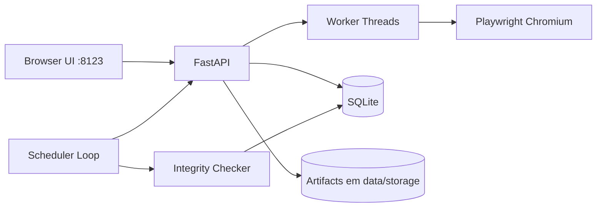
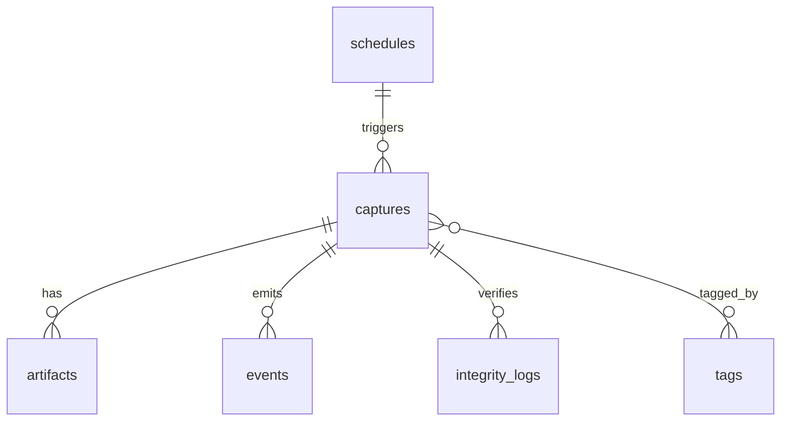

# Parker

Parker é uma aplicação **self-hosted** para arquivamento de páginas web com foco em independência operacional: após instalada, funciona localmente sem depender de SaaS externo para capturar, armazenar, pesquisar e auditar snapshots.

## O que é / para que serve

- Preservar páginas com renderização completa (incluindo JavaScript e lazy loading).
- Criar trilha histórica de snapshots por URL.
- Manter artefatos úteis para auditoria e evidência digital: HTML, screenshot, WARC e PDF opcional.
- Gerenciar biblioteca com busca textual, filtros, tags, paginação e ordenação.
- Garantir confiabilidade com checksums + verificações periódicas de integridade.
- Operar em ambientes com requisitos de privacidade/offline.

---

## Funcionalidades implementadas

### Captura
- Submissão de URL pela interface.
- Execução em background (thread worker + semáforo para limite de concorrência).
- Retry automático com máximo configurável.
- Renderização com Playwright Chromium (JS completo).
- Scroll automático para capturar conteúdo lazy loading.
- Suporte a cookies e headers personalizados.
- Geração de artefatos:
  - `snapshot.html`
  - `snapshot.png`
  - `snapshot.warc`
  - `snapshot.pdf` (opcional)
- Feedback de progresso em tempo real via SSE (`/captures/{id}/events`).

### Gestão de capturas
- Metadados extraídos automaticamente: título, descrição, domínio, data/hora, tamanho total, status HTTP, links, texto para busca.
- Tags com adição/remoção.
- Re-captura da mesma URL gerando novos snapshots.
- Agendamento periódico por intervalo em horas.
- Estados de captura: `success`, `partial`, `failed`.
- Exclusão destrutiva com confirmação na UI.

### Visualização e biblioteca
- Visualização de HTML arquivado direto na interface.
- Visualização/download de todos os artefatos.
- Navegação entre snapshots da mesma URL.
- Busca textual com destaque de trecho.
- Filtros por domínio/status/tag (com paginação).
- Ordenação por data/tamanho.

### Dashboard e confiabilidade
- Dashboard com: total de capturas, uso em disco, domínios distintos, capturas em 7 dias.
- Alerta de disco acima do limite configurado.
- Checksum SHA-256 por artefato no momento da captura.
- Verificação periódica de integridade com log histórico (`integrity_logs`).
- Log detalhado em `data/parker.log`.

### Configuração
- Limite máximo de armazenamento.
- Máximo de capturas simultâneas.
- Timeout de captura.
- Máximo de tentativas.
- Domínios bloqueados.
- Percentual de alerta de disco.

### Backup e portabilidade
- Exportação completa via endpoint (`/backup/export`) em `.zip` contendo banco e storage.
- Script de restauração incluído (`scripts/restore_backup.sh`).

---

## Requisitos

- Python 3.11+
- Chromium (instalado via Playwright)
- Linux/macOS/Windows (execução local) ou Docker
- Porta `8123` livre

---

## Instalação local

```bash
git clone <repo>
cd parker
python -m venv .venv
source .venv/bin/activate  # Linux/macOS
# .venv\Scripts\activate   # Windows
pip install -r requirements.txt
playwright install chromium
uvicorn app.main:app --host 0.0.0.0 --port 8123
```

> Observação: em Linux via Docker, a imagem já executa `playwright install chromium` no build. Em instalações bare-metal, se necessário instale dependências de sistema manualmente (pacotes de fontes/GTK variam por distro).

Acesse: http://localhost:8123

### Solução de problemas (Windows)

Se ao iniciar o Uvicorn ocorrer erro como `FileNotFoundError: ... data\\parker.log`, garanta que está executando os comandos na raiz do projeto e que a pasta `data` exista. Nas versões atuais do Parker isso já é criado automaticamente na importação da aplicação.

---

## Deploy com Docker

### Docker build/run
```bash
docker build -t parker:latest .
docker run --rm -p 8123:8123 -v $(pwd)/data:/app/data parker:latest
```

Se você estiver no Windows PowerShell, use:

```powershell
docker build -t parker:latest .
docker run --rm -p 8123:8123 -v ${PWD}/data:/app/data parker:latest
```

### Docker Compose
```bash
docker compose up -d --build
```

---

## Backup e restauração

### Exportar backup
- Pela UI: menu **Exportar backup**
- Ou via navegador: `GET /backup/export`

### Restaurar backup
```bash
./scripts/restore_backup.sh data/backup_YYYYMMDD_HHMMSS.zip
```

---

## Arquitetura técnica



### Modelo de dados (resumo)



---

## Endpoints principais

- `GET /` dashboard
- `GET /captures` biblioteca
- `POST /captures` criar captura
- `GET /captures/{id}` detalhe
- `GET /captures/{id}/events` progresso SSE
- `GET /artifacts/{id}/view` visualizar artefato
- `GET /artifacts/{id}/download` baixar artefato
- `GET/POST /settings` configuração
- `POST /schedules` agendamento
- `GET /backup/export` exportação completa

---

## Limitações atuais

- WARC contém o payload principal da página (não faz crawl profundo de todos os sub-recursos).
- Interface segue estética inspirada em Material 3 com CSS local simplificado.
- Busca textual usa `LIKE` em SQLite (não FTS avançado).

---

## Segurança e privacidade

- Operação local por padrão.
- Nenhum envio para serviços externos fora da URL explicitamente capturada.
- Logs detalhados para troubleshooting e auditoria.
